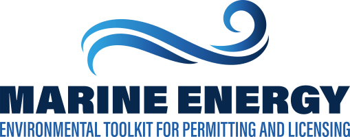

  

  
  

  

  

  
  
  
Welcome to the Marine Energy Environmental Toolkit – a comprehensive compilation of existing environmental, spatial, regulatory, and scientific data relevant to the permitting and development of wave, tidal, river, and ocean current energy-harvesting technologies.  
  The Toolkit was developed in collaboration with regulators and developers to create a useful and lasting permitting and licensing resource. The Toolkit was funded by the U.S. Department of Energy (DOE) and was built to complement other DOE efforts, such as the <a href="https://openei.org/wiki/PRIMRE" target="_blank">Portal and Repository for Information on Marine Renewable Energy (PRIMRE)</a>. Information provided is primarly from <a href="https://tethys.pnnl.gov/knowledge-base" target="_blank">Tethys Knowledge Base</a> and the <a href="https://elibrary.ferc.gov/eLibrary/search" target="_blank">FERC eLibrary</a>.
  

  
  <a href="/about.html" class="btn btn-primary btn-chubby btn-w-arrow">Learn More</a>
  

  

  

  

  
  

  

  

  <h1>The Toolkit</h1>
  
Browse the tiles below to access, search, save, and contribute to the information available in the Marine Energy Toolkit.

  

  

  

  

  
  

  

  
  <h3>PROJECTS</h3>
  
An interactive map and project timelines with access to existing permitting documentation of previously permitted projects in the U.S.

  

  

  
  

  

  
  <h3>Data catalog, mapper and reporting tool</h3>
  
Draw a polygon and generate a report compiling relevant spatial, academic, and regulatory information into one document.

  

  

  
  

  

  
  <h3>ENVIRONMENTAL INTERACTIONS</h3>
  
Access papers on various environmental interactions from the Tethys Knowledge Base.

  

  

  

  
  

  

  

  
  <h3>SEARCHABLE DOCUMENTS</h3>
  
Documents relevant to projects, precedent and mitigation from various academic research and regulatory sources, including references from Tethys and FERC.

  

  

  
  

  

  
  <h3>GUIDELINES AND FLOWCHARTS</h3>
  
Guidelines and flowcharts on applicable regulations, example documents, best practices, and other resources for federal (FERC, USACE, and BOEM) and state (AK, CA, FL, HI, OR, MA, ME, NY, RI, WA) processes.

  

  

  
  

  

  
  <h3>ABOUT MARINE ENERGY</h3>
  
Marine Energy is the harnessing of water’s kinetic energy to generate electricity. It encompasses wave, tidal, and river and ocean current power.

  

  

  

